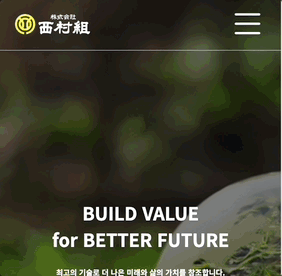

# 니시무라 중공업 리뉴얼 사이트 제작

기존의 사이트를 반응형 웹으로 리뉴얼해보았습니다.
 데모 사이트 링크: 
https://wb96choi.github.io/hyein_bin/

## 기존사이트와의 비교

- before 
    흠잡을 곳 없이 깔끔한 기존의 사이트지만 헤더가 우측에 있는것이 불편하다고 느껴 리뉴얼해보기로 결정했습니다.

- after 
    헤더를 최상단에 배치하고 메인비쥬얼 섹션에 이미지 슬라이드를 추가했습니다.

## 주요 기능 소개
### 헤더

- 스크롤을 감지하여 스크롤을 내리면 헤더의 배경색이 나타나고 동시에 로고이미지도 변경됩니다.
- 네비게이션 메뉴를 hover하면 서브메뉴들이 slideDown됩니다. 우측의 토글메뉴버튼을 클릭하면 서브메뉴가 내려와 고정이됩니다.
   

- 모바일 환경에서는 네비게이션 메뉴를 없애고 토글메뉴바 안에 넣었습니다.
우측의 플러스 버튼을 누르면 서브메뉴가 나타납니다.

### 이미지 슬라이드 기능

- 니시무라의 사람들을 소개하는 이미지들은 자동으로 슬라이드 되지만,
우측의 네비게이션들을 클릭하면 각각의 이미지로 이동됩니다.

### 바로가기 

- 채용문의와 기타문의로 이동하는 바로가기는 호버시 배경이미지가 커지고 글자색이 변화합니다.

   
-----------------------
참고 사이트: http://www.hyein.com/
         https://www.nishimura.co.jp/
